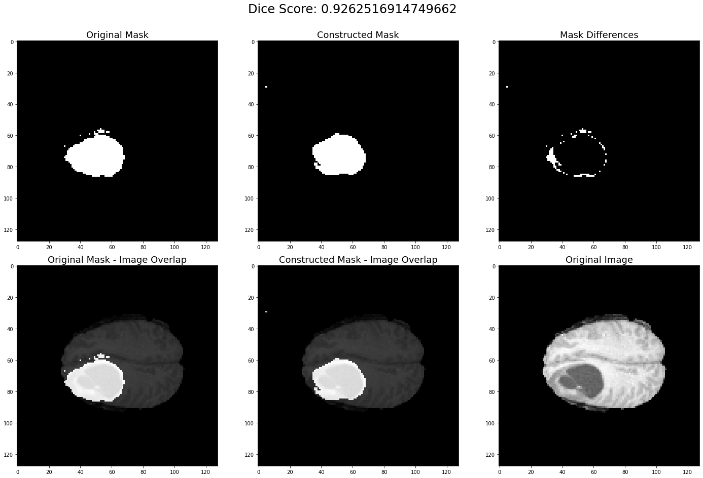

<h1 align="center">Brain Tumor-Segmentation using U2Net</h1>

    

    
## Overview
- [Dataset](#Dataset)
- [Pre-processing](#Pre-processing)
- [Model Architecture](#Model-Architecture)
- [Training Process](#Training-Process)
- [Results](#Results)
- [Usage](#Usage)
- [References](#References)

### Dataset
The dataset used in this project was provided from the public collections of the [The Cancer Imaging Archive (TCIA)](https://www.cancerimagingarchive.net/). A dataset was created by combining 2 public collections.
1. This dataset contains T2-weighted and post-contrast T1-weighted images for each of the 159 subjects. Segmentation of tumors in three axial slices that include the one with the largest tumor diameter and ones below and above are provided in NiFTI format.

For a detailed information about the dataset please refer to this [site](https://wiki.cancerimagingarchive.net/display/Public/LGG-1p19qDeletion).

2. This dataset contains skull-stripped and co-registered multimodal (i.e. T1, T1-Gd, T2, T2-FLAIR) magnetic resonance imaging (MRI) volumes and both computer-aided and manually-corrected segmentation labels in NIfTI format for each of the 65 subjects. T1-weighted and T2-weighted MRI were included in this study.

For a detailed information about the dataset please refer to this [site](https://wiki.cancerimagingarchive.net/pages/viewpage.action?pageId=24282668#24282668197861a846e445a795694ff2a50eb66c).

### Pre-processing

The basic data augmentation methods listed below were used:
- [Horizontally Flip](https://docs.opencv.org/3.4/d2/de8/group__core__array.html#gaca7be533e3dac7feb70fc60635adf441)
- [Vertically Flip](https://docs.opencv.org/3.4/d2/de8/group__core__array.html#gaca7be533e3dac7feb70fc60635adf441)

### Model Architecture

Model architecture is shown in the figure below. 

### Results

- Download pre-trained U2NET models: [u2net.h5](https://drive.google.com/file/d/1fMtz5qBZ22nYv1E_6gymT4uMNK7L3qDO/view?usp=sharing)
- Download pre-trained U2NETP models: [u2netp.h5]()

| Tumor Types \ MRI Sequences  | T1-weighted | T2-weighted | Segmentation |
| :---: | :---: | :---: | :---: | 
| Oligodendroglioma  | 0.81519  | 23.1904  | 5.56554  |
| Oligoastrocytoma  |   |   |   |
| Astrocytoma  | 0.89553  | 1.73205 | 3.16228  |

.             |  .
:-------------------------:|:-------------------------:
  |  
  |  
  |  

### References 
[Original Paper](https://arxiv.org/abs/2005.09007v3)
